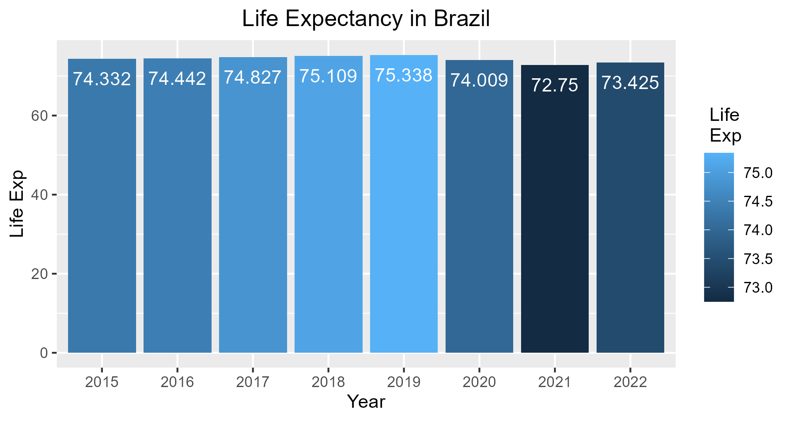
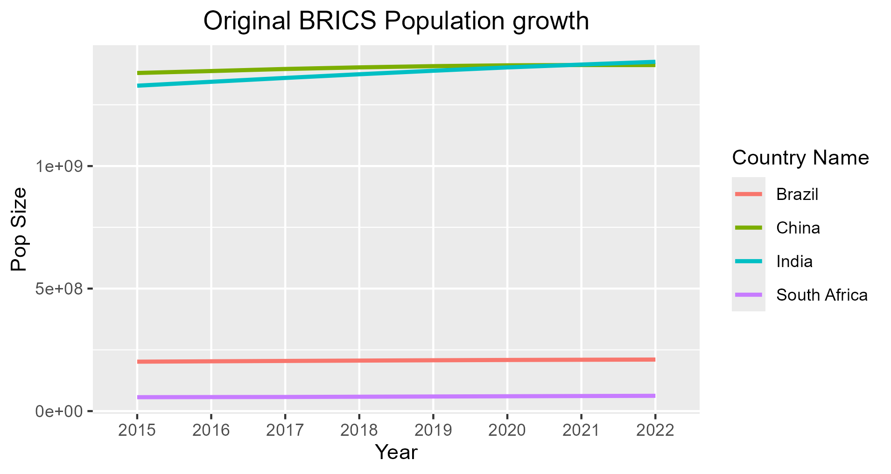
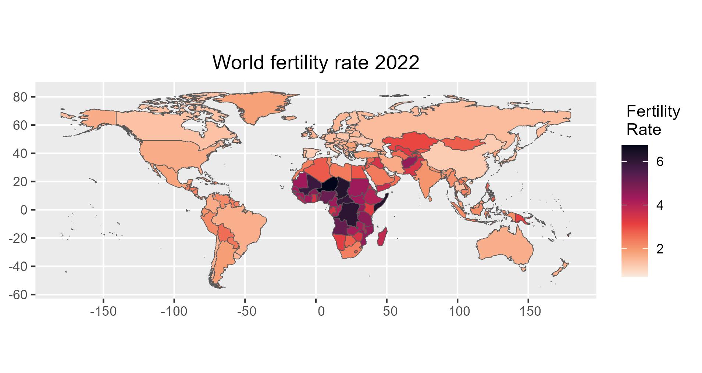
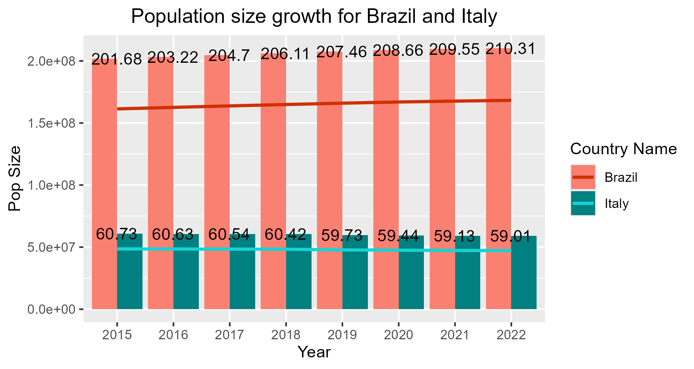
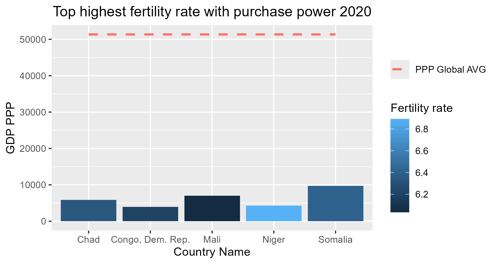
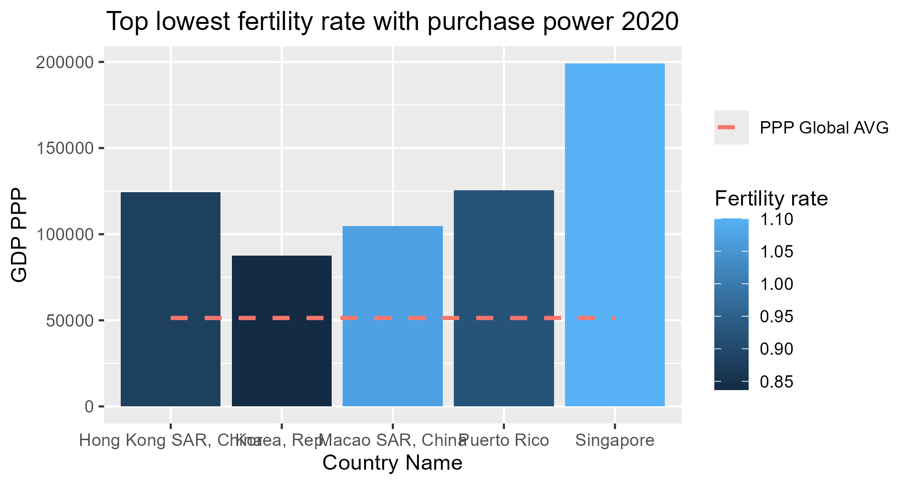
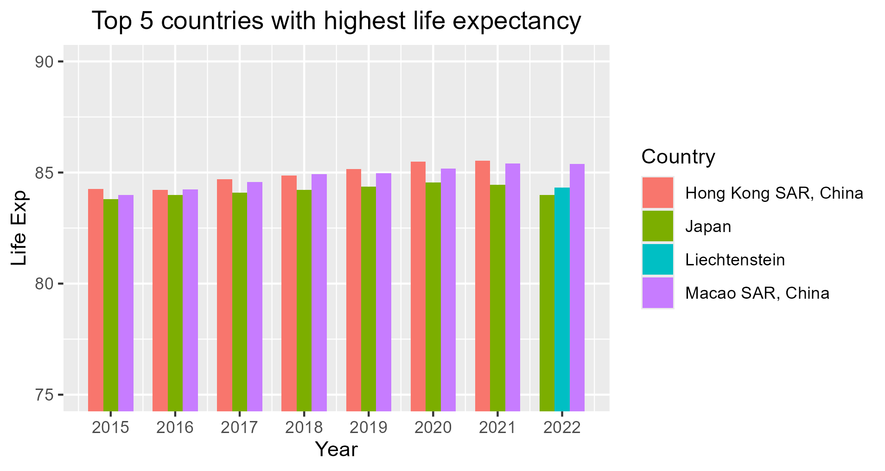

# World Data Analysis

 - Exploratory Data Analysis with real world data using R.

## Data Sourced from:
https://databank.worldbank.org/source/world-development-indicators#

https://data.un.org/Default.aspx

## Plots

